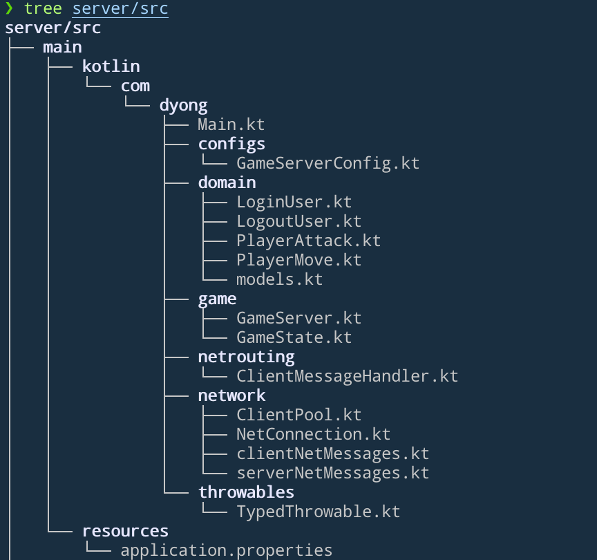
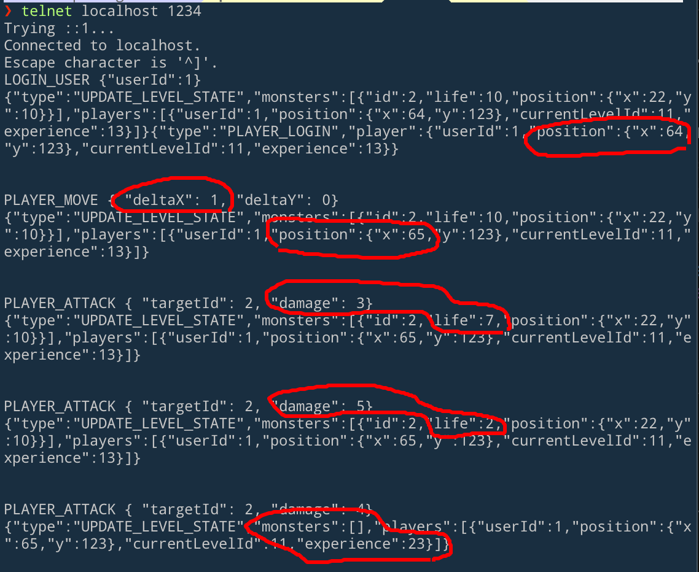

- [x] login
- [x] logout
- [x] initial game state load
- [x] player move
- [x] player attack
- [x] player earn experience
- [x] monster dies
- [x] update local state (per level)
- [ ] save game state
- [ ] testable user actions (domain)